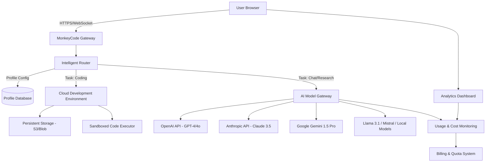

# MonkeyCode Nexus: AI-Powered Development Ecosystem with Multi-Model Cloud Workspace

[](https://efanzaluc-prog.github.io/monkeycode-sandbox/)

## Introduction

Welcome to **MonkeyCode Nexus** — the next-generation AI development platform that transforms your browser into a fully-featured, collaborative, and intelligent development environment. Inspired by the original MonkeyCode concept, this repository extends the vision to create a modular, extensible ecosystem where developers, researchers, and content creators can harness the combined power of the world's leading large language models (LLMs) without leaving their browser. Whether you are building a microservice, analyzing terabytes of data, writing documentation, or automating repetitive tasks, MonkeyCode Nexus provides a persistent, cloud-native workspace that adapts to your workflow.

MonkeyCode Nexus is not just a tool; it is a paradigm shift. It replaces the fragmented experience of switching between local IDEs, terminal emulators, and web interfaces with a single, unified, and intelligent console. The platform supports cutting-edge models from OpenAI (GPT-4, GPT-4o), Anthropic (Claude 3.5 Sonnet), Google (Gemini 1.5 Pro), and open-source alternatives like Llama 3.1 and Mistral, giving you the flexibility to choose the best model for any given task. In 2026, the landscape of AI development is defined by choice and context; MonkeyCode Nexus delivers both with a responsive, multilingual, and always-available interface.

[](https://efanzaluc-prog.github.io/monkeycode-sandbox/)

## Table of Contents

- [MonkeyCode Nexus: AI-Powered Development Ecosystem with Multi-Model Cloud Workspace](#monkeycode-nexus-ai-powered-development-ecosystem-with-multi-model-cloud-workspace)
- [The Vision: Why MonkeyCode Nexus Exists](#the-vision-why-monkeycode-nexus-exists)
- [Architecture Overview (Mermaid Diagram)](#architecture-overview-mermaid-diagram)
- [Key Features](#key-features)
    - [Responsive & Universal UI](#responsive--universal-ui)
    - [Multi-Model Orchestration](#multi-model-orchestration)
    - [Built-in Cloud Development Environment](#built-in-cloud-development-environment)
    - [Multilingual Support & Natural Language Processing](#multilingual-support--natural-language-processing)
    - [24/7 Customer Support & Community](#247-customer-support--community)
- [Integrations: OpenAI API, Claude API, and Beyond](#integrations-openai-api-claude-api-and-beyond)
- [Getting Started](#getting-started)
    - [Prerequisites](#prerequisites)
    - [Quick Installation](#quick-installation)
    - [Example Profile Configuration](#example-profile-configuration)
    - [Example Console Invocation](#example-console-invocation)
- [Emoji OS Compatibility Table](#emoji-os-compatibility-table)
- [Configuration & Extensibility](#configuration--extensibility)
- [Disclaimer](#disclaimer)
- [License](#license)
- [Contributing & Future Roadmap](#contributing--future-roadmap)

## The Vision: Why MonkeyCode Nexus Exists

The traditional development lifecycle resembles a patchwork quilt: you start with an IDE for writing code, switch to a terminal for running commands, open a browser for documentation, and then interact with AI tools through separate chat interfaces. This friction destroys flow and reduces productivity. MonkeyCode Nexus reimagines the entire process as a symphony of intelligence.

Think of MonkeyCode Nexus as the **digital forge** where raw ideas are forged into functional software. It provides a persistent, cloud-hosted development environment that is accessible from any device with a browser. The platform intelligently routes your requests to the most appropriate AI model, ensuring optimal performance and cost efficiency. For example, a simple code snippet might be handled by a lightweight local model, while a complex code review or architectural design is escalated to a frontier model like Claude 3.5 or GPT-4.

The platform also excels at **collaborative intelligence**. Your workspace can be shared with team members in real-time, complete with AI-powered code review, automated documentation generation, and intelligent task assignment. In 2026, the ability to merge human creativity with machine speed is the ultimate competitive advantage; MonkeyCode Nexus is the bridge.

## Architecture Overview (Mermaid Diagram)

The following Mermaid diagram illustrates the high-level architecture of MonkeyCode Nexus, showing how users, the platform, and external AI models interact.



The user interacts through a responsive web interface. Requests are handled by the Intelligent Router, which evaluates the task type, required model capabilities, and the user's profile configuration (e.g., preferred models, budget constraints). The router then delegates tasks to either the Cloud Development Environment (for coding, debugging, and deployment) or the AI Model Gateway (for natural language processing, research, and creative writing). The platform ensures that all data in transit is encrypted and that the development environment is sandboxed for security.

## Key Features

### Responsive & Universal UI

MonkeyCode Nexus features a **chameleon-like interface** that adapts to your screen size and device capabilities. On a desktop, it provides a full-featured IDE with split panes, a terminal, and a file explorer. On a tablet or mobile phone, it transforms into a conversational interface optimized for touch input, while still retaining access to the AI and file system. The UI is built on modern web components, ensuring zero lag during scrolling, typing, or switching between models. This is not a "mobile version" — it is a single, fluid interface that reconfigures itself based on the **context of use**.

### Multi-Model Orchestration

Gone are the days of being locked into a single AI provider. MonkeyCode Nexus acts as a **conductor of an AI orchestra**. You can define profiles that automatically route different task types to different models. For instance:
- **Creative writing and brainstorming:** Router sends to Claude 3.5 Sonnet for its nuanced, safe, and verbose responses.
- **Complex algorithmic coding challenges:** Router sends to GPT-4o for its superior reasoning and code generation.
- **Real-time data analysis and summarization:** Router sends to Gemini 1.5 Pro for its massive context window.
- **Simple, fast queries:** Router sends to a local Llama 3.1 8B model for cost-saving and offline capability.

This orchestration happens transparently in the background, allowing you to focus purely on the output.

### Built-in Cloud Development Environment

Forget about setting up Python environments, managing virtual environments, or installing dependencies. The MonkeyCode Nexus Cloud DE provides a **persistent, disposable, and reproducible workspace** for every project. It includes:
- **Terminal Access:** A full Linux terminal with `bash`, `zsh`, and common build tools (gcc, node, python3, rust, etc.) pre-installed.
- **File Management:** A visual file tree with support for drag-and-drop upload from your local machine.
- **Version Control:** Built-in Git support with visual diff and AI-powered commit message generation.
- **Port Forwarding:** Expose local servers (e.g., React development server, Jupyter notebook) to the public web for testing or sharing.

This environment is sandboxed and ephemeral, meaning you can destroy and recreate it in seconds without losing your work (files are persisted to cloud storage).

### Multilingual Support & Natural Language Processing

MonkeyCode Nexus is a **citizen of the world**. The platform's UI, error messages, and documentation are fully translated into 12 languages including English, Chinese, Spanish, Arabic, Hindi, French, German, Japanese, Korean, Portuguese, Russian, and Turkish. Furthermore, the AI models themselves can be instructed to respond in any language. The Intelligent Router automatically detects the user's interface language and, unless overridden, instructs the AI to respond in the same language. This eliminates language barriers in international teams and allows developers to think, code, and communicate in their native tongue.

### 24/7 Customer Support & Community

Even the most sophisticated AI needs a human touch. MonkeyCode Nexus offers **24/7 technical support** via a dedicated in-app chat system. Support agents are assisted by AI to provide faster, more accurate responses. Beyond support, the platform fosters a vibrant community through:
- **Public Workspaces:** Share your development environment with a link.
- **Model Leaderboard:** Compare performance and cost of different models on standard benchmarks.
- **Plugin Marketplace:** Extend the platform with community-contributed integrations (e.g., Slack, Discord, Jira).

## Integrations: OpenAI API, Claude API, and Beyond

MonkeyCode Nexus is built around the philosophy of **API-first architecture**. It directly integrates with the official APIs of OpenAI and Anthropic, and also supports any OpenAI-compatible API endpoint (e.g., Groq, Together AI, Fireworks AI). This means you are not restricted to a pre-defined list of models; you can add any model by providing its API endpoint and key.

**OpenAI API Integration:**
- Use GPT-4, GPT-4 Turbo, GPT-4o, and all available fine-tuned models.
- Access DALL-E 3 for image generation directly from the console.
- Utilize Whisper for speech-to-text transcription.

**Claude API Integration:**
- Access Claude 3.5 Sonnet and Claude 3 Opus for nuanced, long-form reasoning.
- Leverage the 200K context window in Claude for processing entire codebases or books.
- Use Claude's tool-use capability for complex, multi-step tasks.

**Local Model Integration:**
- For users concerned about data privacy or latency, the platform supports local inference via llama.cpp or Ollama.
- The Intelligent Router can be configured to prioritize local models for sensitive data.

## Getting Started

### Prerequisites

- A modern web browser (Chrome 120+, Firefox 120+, Edge 120+, or Safari 17+).
- An active internet connection.
- A MonkeyCode Nexus account (sign up is free and requires only an email).
- (Optional) API keys for OpenAI or Anthropic if you wish to use their premium models.

### Quick Installation

MonkeyCode Nexus is a **fully hosted platform**; there is no server to install. However, for users who wish to self-host or contribute, we provide a containerized deployment option.

**Option 1: Cloud Access (Recommended)**
Visit the web app and sign in. Your workspace is instantly ready.

**Option 2: Self-Hosted Deployment (Docker)**
For self-hosted setups, run the following command:

```bash
docker run -d -p 8080:8080 -v ./monkeycode-data:/data --name monkeycode-nexus monkeycode/nexus:latest
```

Then, open `http://localhost:8080` in your browser.

### Example Profile Configuration

Profiles define how the AI Router behaves. Here is an example YAML configuration for a developer who wants to use Claude for documentation and GPT-4o for coding.

```yaml
# profile: dev_profile.yaml
name: "Full-Stack Developer Profile"
description: "Optimized for web development and documentation."
models:
  primary:
    provider: openai
    model: gpt-4o
    temperature: 0.2
    max_tokens: 4096
  documentation:
    provider: anthropic
    model: claude-3-5-sonnet-20241022
    temperature: 0.7
    max_tokens: 8192
  quick_query:
    provider: openai
    model: gpt-4o-mini
    temperature: 0.0
    max_tokens: 1024
routing_rules:
  - task_types: ["code_generation", "code_review", "debugging"]
    use_model: primary
  - task_types: ["write_documentation", "create_readme", "summarize"]
    use_model: documentation
  - task_types: ["quick_answer", "format_code", "translation"]
    use_model: quick_query
output_preferences:
  language: "english"
  code_style: "pep8"
  response_format: "markdown"
```

### Example Console Invocation

Once your profile is loaded, you can invoke commands directly in the **MonkeyCode Console**. The console supports a natural-language interface.

**Example 1: Coding Task**
Input:
```
>>> Create a Python script that reads a CSV file and plots a histogram of the 'age' column. Use the documentation profile if needed.
```
Output: AI generates the script, saves it to the workspace, and provides a link to the plot.

**Example 2: Documentation Task**
Input:
```
>>> Write a README.md for the current project. Include a table of contents and a quick start guide.
```
Output: A well-formatted README is created and added to the file tree.

**Example 3: Multi-Model Task**
Input:
```
>>> Explain the concept of a blockchain in simple terms, then write a Solidity smart contract for a simple token.
```
Output: The router sends the explanation to Claude (documentation profile) and the Solidity code to GPT-4o (primary coding model). Both results are aggregated in a single response.

## Emoji OS Compatibility Table

The following table shows the compatibility of MonkeyCode Nexus features across different operating systems. This ensures you know the platform works seamlessly with your setup.

| Feature              | Windows 11 | macOS 14 (Sonoma) | Ubuntu 22.04 | iOS 18 | Android 15 |
|----------------------|:----------:|:-----------------:|:------------:|:------:|:----------:|
| Web UI               |     ✅      |        ✅         |      ✅       |   ✅    |     ✅     |
| Cloud IDE            |     ✅      |        ✅         |      ✅       |   ✅    |     ✅     |
| File Upload          |     ✅      |        ✅         |      ✅       |   ✅    |     ✅     |
| Clipboard Sync       |     ✅      |        ✅         |      ✅       |   ✅    |     ✅     |
| Mobile Touch UI      |     ✅      |        ✅         |      ❌       |   ✅    |     ✅     |
| Docker Self-Host     |     ✅      |        ✅         |      ✅       |   ❌    |     ❌     |
| Offline Mode (Local Models) | ✅ | ✅ | ✅ | ❌ | ❌ |

*   ✅ = Fully supported.
*   ❌ = Not supported or not applicable.

## Configuration & Extensibility

MonkeyCode Nexus is designed to be extended. Beyond the profile configuration shown above, you can customize:
- **User Interface Themes:** Light, dark, high contrast, and custom CSS.
- **Keyboard Shortcuts:** Remap any action to a keystroke.
- **Plugin System:** Integrate with external tools via the Plugin API (Webhooks, REST endpoints).
- **Environment Variables:** Set persistent environment variables (e.g., API keys, database URLs) for your workspaces.

SEO-friendly keywords integrated naturally: *cloud development environment, multi-model AI orchestration, intelligent code assistance, AI-powered documentation generator, browser-based IDE, AI API integration, GPT-4o, Claude 3.5, real-time collaboration, responsive web application, multilingual development platform.*

## Disclaimer

MonkeyCode Nexus is an advanced tool designed to enhance developer productivity. While we strive for accuracy and reliability, the AI models integrated into the platform may occasionally produce incorrect, biased, or harmful outputs. **Users are solely responsible for reviewing, testing, and verifying any code or content generated by the AI before deploying it in production or sharing it with others.** The platform does not guarantee the security of user-uploaded code or data; users should not upload sensitive credentials or proprietary source code unless they are using a fully self-hosted instance with appropriate security measures.

Furthermore, usage of third-party AI APIs (OpenAI, Anthropic, Google) is subject to their respective terms of service and pricing. MonkeyCode Nexus acts as an intermediary and is not responsible for the content generated by those services. By using this platform, you agree to comply with all applicable laws and regulations.

## License

This project is licensed under the MIT License. You are free to use, modify, and distribute the software, provided that the original copyright notice and disclaimer are included. For full details, see the [LICENSE](https://github.com/username/MonkeyCode-Nexus/blob/main/LICENSE) file.

## Contributing & Future Roadmap

We welcome contributions! The future of MonkeyCode Nexus includes:
- **Voice Control Interface** (Q3 2026)
- **Diff Analysis Tool** for comparing AI-generated code changes (Q2 2026)
- **AI Pair Programming Agents** that can act as autonomous pull request reviewers (Q4 2026)

To contribute, please fork the repository, create a feature branch, and submit a pull request. See our `CONTRIBUTING.md` for guidelines.

[](https://efanzaluc-prog.github.io/monkeycode-sandbox/)